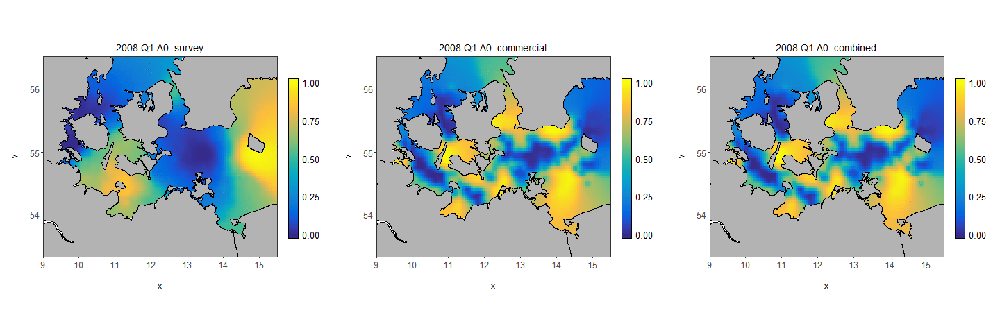

# LGNB

**Welcome to the LGNB model GitHub repository!**

If you have made it so far, this likely means that you are interested in seing how the LGNB model actually works and can be applied. :)

Besides estimating and predicting the spatio-temporal abundance dynamics of marine harvested species, the LGNB framework includes a set of tools that can be used to evaluate and contrast the different models, such as GIFs below.


 


It is therefore aimed to provide some basic guidence throughout the scripts that are used for the modelling aspect, and higlight some pitfalls that might lead to **dangerous** result interpretation or even model crashing if not properly addressed.

Theoretical aspects of the model won't be discussed here, but more details can be found on [Bridging the gap between commercial fisheries and scientific survey data to model the spatio-temporal dynamics of harvested marine species](https://www.google.com).
Note also that this is **not** an introduction to R nor C++ languages; hence, familiarity with both of them is expected from the user.


***
## Getting started

As parameter estimates are done with Template Model Builder (TMB), the very first step is to ensure that it is properly installed in R. TMB depends on R version >=3.0.0 and a set of other tools, and can be installed through the following command:

```R
install.packages("TMB")
```

If you are working on another OS than Windows, pelase refer to the main [TMB](https://github.com/kaskr/adcomp/wiki/Download) webpage to see the proper package installation according to your platform.

***
The model package is essentially composed by three main scripts, namely: *model.cpp*, *model.R*, and *utilities.R*. In the following each script is shortly commented.

### > model.cpp 
This script forms the backbone of all the upcoming modelling procedures. In fact, modelling with TMB is all about the C++ file (also known by the program template), and requires therefore some basic knowledge on C++ language. Coding in C will probably be your last concern - writing down your actual model and making it compile will certainly be amongst the main challanges you will face! Within the C++ file, one basically speciefies three different steps: (i) the data structure that describes the model  under concern (e.g., a matrix of covariables, a vector of the response variable); (ii) the set of parameters describing the model and which will be estimated (e.g., parameters of the fixed and random effects); (iii) the function to be minimized, i.e., a mathematical description of a conceptual model such as LM, GLM(M) and GAM(M)). The proper function minimization is done from within R.


### >model.R 
This is where all data reading and remaining modelling aspects will occur, which includes (i) data cleaning & handling to fit in the same format as specified in the *model.cpp* script, (ii) inital parameter values specification (either through a vector or matrix), (iii) compilation of the C++ model and linking it to R, (iv) running (minimizing) the model function, and (v) finally analyze all  results. This script also calls the *utilities.R* script, which gathers a set of helper functions that are used within the *model.R* script.


### >utilities.R 
Here several helper functions are gathered together,among them the cohort extraction function, the commercial-survey data binding function, and the TMB-adapted AIC function. 


**Detailed guidance on each above commented script can be found on the [Wiki page](https://github.com/mcr89/LGNB/wiki).**


***

### Note that this is a work in progress!

***


